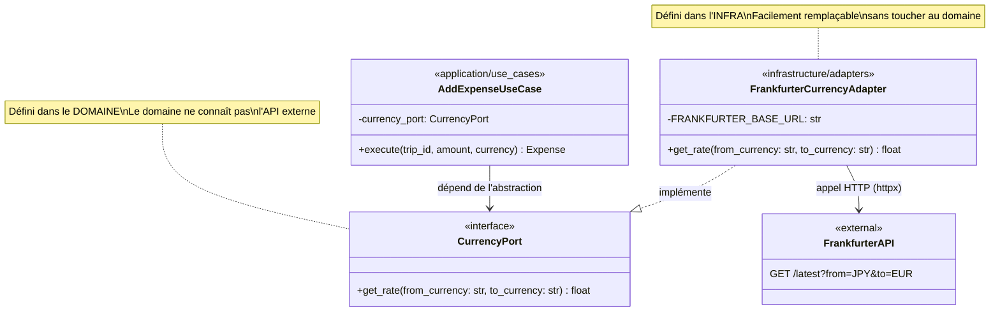

```mermaid
classDiagram
    direction TB

    class CurrencyPort {
        <<interface>>
        <<domain/interfaces>>
        +get_rate(from_currency: str, to_currency: str) float
    }

    class FrankfurterCurrencyAdapter {
        <<infrastructure/adapters>>
        -FRANKFURTER_BASE_URL: str
        +get_rate(from_currency: str, to_currency: str) float
        %% Appel HTTP → api.frankfurter.app/latest
        %% Traduit la réponse JSON en float pour le domaine
    }

    class AddExpenseUseCase {
        <<application/use_cases>>
        -currency_port: CurrencyPort
        +execute(trip_id, amount, currency) Expense
        %% Utilise uniquement le Port — ignore l'Adapter
    }

    class FrankfurterAPI {
        <<external>>
        GET /latest?from=JPY&to=EUR
    }

    %% Relations
    AddExpenseUseCase --> CurrencyPort : dépend de l'abstraction
    FrankfurterCurrencyAdapter ..|> CurrencyPort : implémente
    FrankfurterCurrencyAdapter --> FrankfurterAPI : appel HTTP (httpx)

    note for CurrencyPort "Défini dans le DOMAINE\nLe domaine ne connaît pas\nl'API externe"
    note for FrankfurterCurrencyAdapter "Défini dans l'INFRA\nFacilement remplaçable\nsans toucher au domaine"
```
