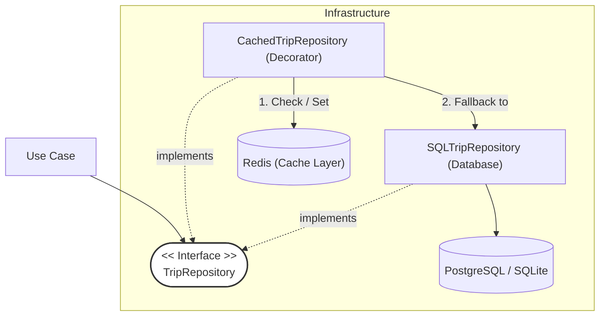

```mermaid
graph TD
    UC[Use Case] --> IRepo([<< Interface >> <br/> TripRepository])

    subgraph Infrastructure
        CachedRepo["CachedTripRepository (Decorator)"] -.->|implements| IRepo
        SQLRepo["SQLTripRepository (Database)"] -.->|implements| IRepo

        CachedRepo -->|1. Check / Set| Redis[("Redis (Cache Layer)")]
        CachedRepo -->|2. Fallback to| SQLRepo
        SQLRepo --> DB[("PostgreSQL / SQLite")]
    end

    %% Style pour l'interface
    style IRepo fill:#fff,stroke:#333,stroke-width:2px
```
