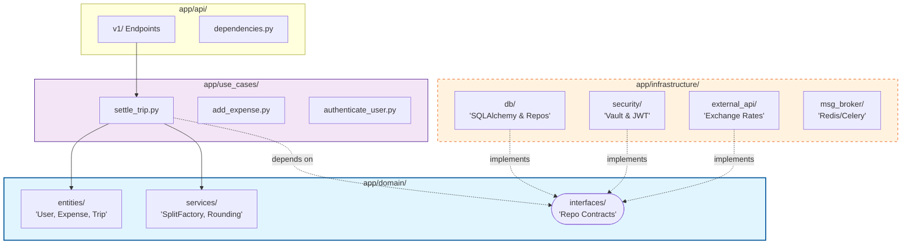

# Architecture Layers

```mermaid
graph TD
    %% Couche Entrée (Framework)
    subgraph API_Layer [app/api/]
        API[v1/ Endpoints]
        Dep[dependencies.py]
    end

    %% Couche Orchestration
    subgraph Application_Layer [app/use_cases/]
        UC_Settle[settle_trip.py]
        UC_Add[add_expense.py]
        UC_Auth[authenticate_user.py]
    end

    %% Couche Cœur Métier
    subgraph Core_Domain [app/domain/]
        Entities[entities/ <br/>'User, Expense, Trip']
        Services[services/ <br/>'SplitFactory, Rounding']
        Interfaces([interfaces/ <br/>'Repo Contracts'])
    end

    %% Couche Technique
    subgraph Infra_Layer [app/infrastructure/]
        DB[db/ <br/>'SQLAlchemy & Repos']
        Sec[security/ <br/>'Vault & JWT']
        Ext[external_api/ <br/>'Exchange Rates']
        Broker[msg_broker/ <br/>'Redis/Celery']
    end

    %% Relations de dépendances
    API --> UC_Settle
    UC_Settle --> Entities
    UC_Settle --> Services
    UC_Settle -.->|depends on| Interfaces

    %% Implémentations (Inversion de contrôle)
    DB -.->|implements| Interfaces
    Sec -.->|implements| Interfaces
    Ext -.->|implements| Interfaces

    %% Styles
    style Core_Domain fill:#e1f5fe,stroke:#01579b,stroke-width:2px
    style Application_Layer fill:#f3e5f5,stroke:#4a148c
    style Infra_Layer fill:#fff3e0,stroke:#e65100,stroke-dasharray: 5 5
```
