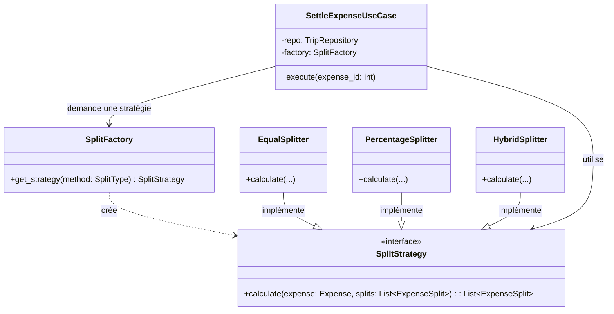

```mermaid
classDiagram
    class SplitFactory {
        +get_strategy(method: SplitType) SplitStrategy
    }

    class SplitStrategy {
        <<interface>>
        +calculate(expense: Expense, splits: List~ExpenseSplit~): List~ExpenseSplit~
    }

    class EqualSplitter {
        +calculate(...)
        %% Divise amount_pivot également entre tous les splits
    }

    class PercentageSplitter {
        +calculate(...)
        %% Utilise weight_percentage de MEMBERSHIP pour chaque membre
    }

    class HybridSplitter {
        +calculate(...)
        %% Normalise share_ratio des splits sélectionnés
        %% amount_owed = amount_pivot * (share_ratio / total_shares)
        %% Les membres sans ExpenseSplit ne doivent rien
    }

    class SettleExpenseUseCase {
        -repo: TripRepository
        -factory: SplitFactory
        +execute(expense_id: int)
    }

    %% Relations
    SettleExpenseUseCase --> SplitFactory : demande une stratégie
    SplitFactory ..> SplitStrategy : crée
    EqualSplitter --|> SplitStrategy : implémente
    PercentageSplitter --|> SplitStrategy : implémente
    HybridSplitter --|> SplitStrategy : implémente
    SettleExpenseUseCase --> SplitStrategy : utilise
```
