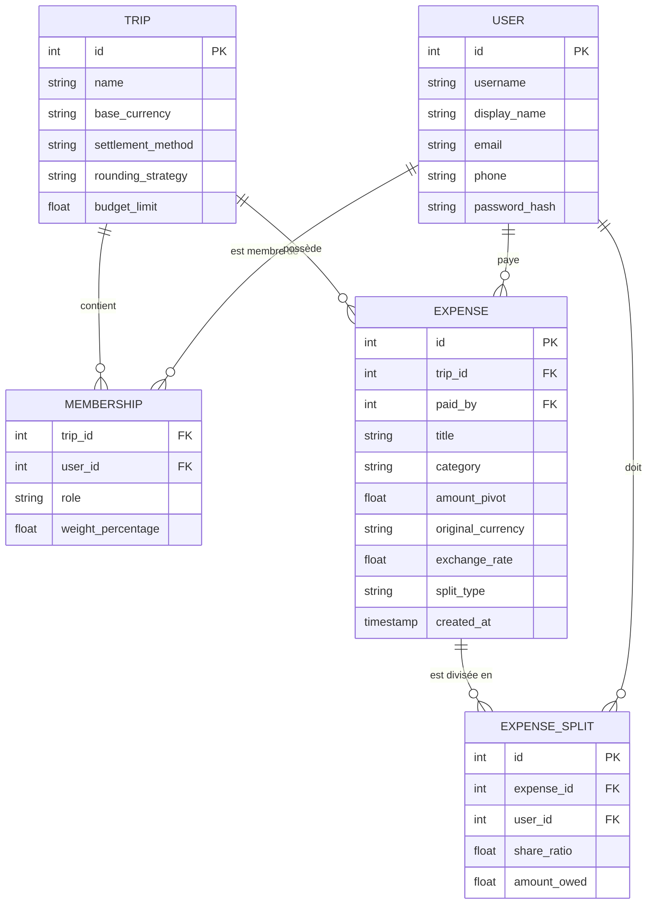

```mermaid
erDiagram
    USER ||--o{ MEMBERSHIP : "est membre de"
    USER ||--o{ EXPENSE : "paye"
    USER ||--o{ EXPENSE_SPLIT : "doit"
    TRIP ||--o{ MEMBERSHIP : "contient"
    TRIP ||--o{ EXPENSE : "possède"
    EXPENSE ||--o{ EXPENSE_SPLIT : "est divisée en"

    USER {
        int id PK
        string username
        string display_name
        string email
        string phone
        string password_hash
    }

    TRIP {
        int id PK
        string name
        string base_currency
        string settlement_method
        string rounding_strategy
        float budget_limit
    }

    MEMBERSHIP {
        int trip_id FK
        int user_id FK
        string role
        float weight_percentage
    }

    EXPENSE {
        int id PK
        int trip_id FK
        int paid_by FK
        string title
        string category
        float amount_pivot
        string original_currency
        float exchange_rate
        string split_type
        timestamp created_at
    }

    EXPENSE_SPLIT {
        int id PK
        int expense_id FK
        int user_id FK
        float share_ratio
        float amount_owed
    }
```
