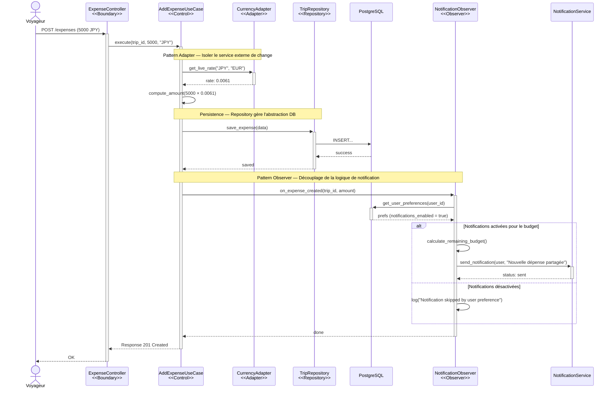

```mermaid
sequenceDiagram
    actor User as Voyageur
    participant Ctrl as ExpenseController<br/><<Boundary>>
    participant UC as AddExpenseUseCase<br/><<Control>>
    participant Adapter as CurrencyAdapter<br/><<Adapter>>
    participant Repo as TripRepository<br/><<Repository>>
    participant DB as PostgreSQL
    participant Obs as NotificationObserver<br/><<Observer>>
    participant Notif as NotificationService

    User->>+Ctrl: POST /expenses (5000 JPY)

    Ctrl->>+UC: execute(trip_id, 5000, "JPY")

    Note over UC,Adapter: Pattern Adapter — Isoler le service externe de change
    UC->>+Adapter: get_live_rate("JPY", "EUR")
    Adapter-->>-UC: rate: 0.0061

    UC->>UC: compute_amount(5000 × 0.0061)

    Note over UC,Repo: Persistence — Repository gère l'abstraction DB
    UC->>+Repo: save_expense(data)
    Repo->>DB: INSERT...
    DB-->>Repo: success
    Repo-->>-UC: saved

    Note over UC,Obs: Pattern Observer — Découplage de la logique de notification
    UC->>+Obs: on_expense_created(trip_id, amount)

    Obs->>+DB: get_user_preferences(user_id)
    DB-->>-Obs: prefs (notifications_enabled = true)

    alt Notifications activées pour le budget
        Obs->>Obs: calculate_remaining_budget()
        Obs->>+Notif: send_notification(user, "Nouvelle dépense partagée")
        Notif-->>-Obs: status: sent
    else Notifications désactivées
        Obs->>Obs: log("Notification skipped by user preference")
    end

    Obs-->>-UC: done

    UC-->>-Ctrl: Response 201 Created

    Ctrl-->>-User: OK
```
